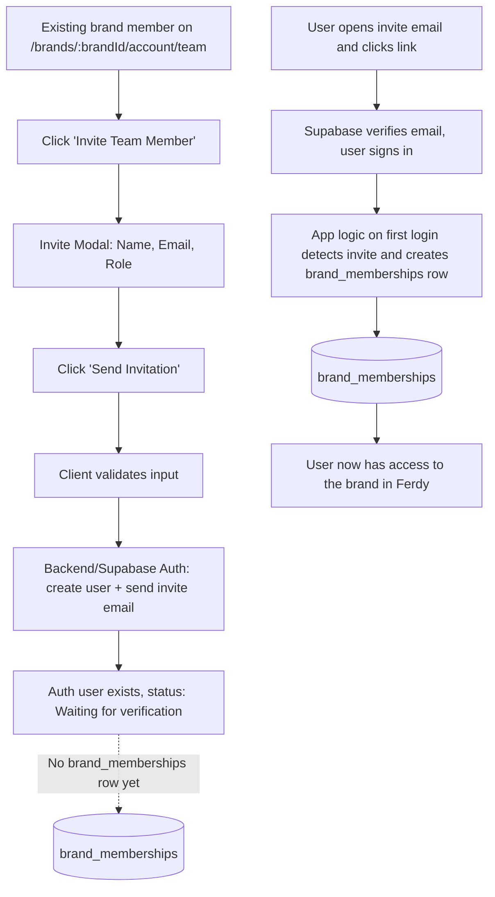

# Team Member Invitation Process

This document details the process of inviting a team member to a brand in the Ferdy application. It covers the user interface flow, the authentication and authorization mechanisms, and the creation of brand memberships.

## User Interface and Initial Actions

The invitation process begins on the Team page, accessible at `/brands/:brandId/account/team`. An existing member of the brand with appropriate permissions can initiate an invitation by clicking the "Invite Team Member" button. This action opens a modal window with the following fields:

-   **Name**: The full name of the person being invited.
-   **Email Address**: The email address of the invitee.
-   **Role**: A dropdown menu to select the user's role, which defaults to "Editor".

Upon clicking "Send Invitation," the client-side application validates the input and triggers the backend invitation flow.

## Authentication and User Creation

The backend is responsible for creating or locating a user in Supabase Auth and sending an invitation email. The process differs depending on whether the invited user is new to Ferdy or an existing user.

### New User Invitation

If the invited user does not have an existing Ferdy account, a new user record is created in Supabase Auth with a "Waiting for verification" status. An invitation email is sent to the user's email address, containing a link to verify their account and set a password. The invitation link is valid for seven days.

### Existing User Invitation

If the invited user already has a Ferdy account, they are sent an email with a magic link that allows them to join the brand. This link is valid for 24 hours.

## Brand Membership Creation

Crucially, a `brand_memberships` record is **not** created at the time of invitation. Instead, Ferdy waits until the invited user successfully signs in and accepts the invitation. The process is as follows:

1.  **At the time of invitation**: A user record is created in Supabase Auth, but no `brand_memberships` row is created for the user and brand.
2.  **Upon first successful sign-in**: After the user clicks the invitation link and signs in, the application logic detects that the user has been invited to a specific brand. It then creates a new row in the `brand_memberships` table with the appropriate `brand_id`, `user_id`, and `role`.
3.  **After membership creation**: The user is granted access to the brand and can see it listed in their account. The Team page will also be updated to include the new member.

To ensure that the correct brand and role are associated with the user upon sign-in, the application must store this information. This is typically achieved through the use of `user_metadata` in Supabase Auth, a separate `invitations` table, or by including signed tokens or query parameters in the invitation link.

## End-to-End Invitation Flow

The following diagram illustrates the complete end-to-end flow for inviting a team member:

## Email Delivery and Security

All invitation emails are sent using Resend, a third-party email delivery service. The emails are branded with the Ferdy logo and sent from a `@ferdy.io` address. The backend generates a secure, time-limited invitation or magic link using Supabase Auth's `generateLink` method.

### Security Considerations

-   Only members of a brand with the appropriate permissions should be able to invite others to that brand.
-   The creation of `brand_memberships` rows should be restricted to prevent users from adding themselves to arbitrary brands.
-   Row-Level Security (RLS) policies should be in place to ensure that `brand_memberships` inserts and updates are only allowed through trusted backend logic or policies that validate the user's `auth.uid()` and invitation metadata.
