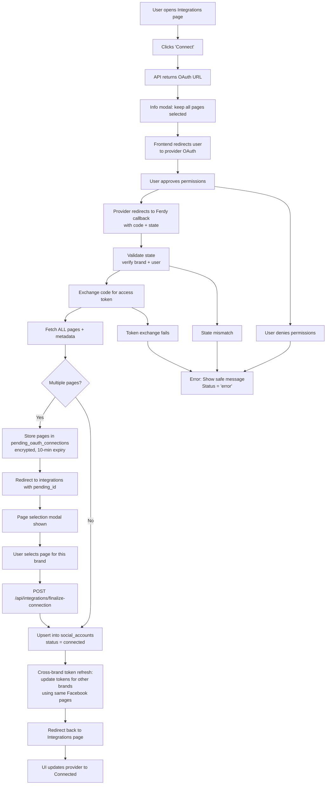

# Process: Connect Social Accounts via API (OAuth)

## Purpose

Allow a brand user to securely connect their social media accounts (Facebook Page, Instagram Business, LinkedIn) to Ferdy so the system can:

- Read basic account/page information
- Read recent posts for analytics/post-information
- Publish posts on behalf of the brand
- Monitor connection health and token expiry

This document describes the full flow from user clicking "Connect" through to successful storage of tokens and activation of publishing.

---

## Scope

**Includes**
- UI flow in Integrations
- Building OAuth URLs
- Handling OAuth callbacks
- Token storage in `social_accounts`
- Account metadata retrieval
- Status updates, errors, and reconnection logic

**Excludes**
- Publishing pipeline (see publishing docs)
- Draft generation (see draft_lifecycle.md)

---

## Actors

- **Brand User**
- **Ferdy Web App (Next.js)**
- **Ferdy API / Server**
- **Social Providers**: Facebook, Instagram, LinkedIn

---

## Key Data Structures

### `social_accounts` table

| Column | Description |
|--------|-------------|
| `id` | Primary key |
| `brand_id` | Foreign key to brands |
| `provider` | `'facebook' | 'instagram' | 'linkedin'` |
| `account_id` | Provider account/page/IG business ID |
| `account_name` | Display name |
| `access_token` | Stored encrypted |
| `refresh_token` | Nullable (varies by provider) |
| `expires_at` | Token expiry timestamp |
| `scopes` | Granted permissions |
| `status` | `'connected' | 'expired' | 'disconnected' | 'error'` |
| `last_health_check_at` | Timestamp |
| `created_at`, `updated_at` | Audit fields |

---

## High-level OAuth Flow



## Detailed Steps

### 1. User opens Integrations page

**Route:** `/brands/[brandId]/engine-room/integrations`

UI loads all rows in `social_accounts` for the brand.

Shows:
- **Not Connected** → Connect button
- **Connected** → account name + Disconnect/Refresh
- **Error/Expired** → Reconnect option

### 2. User clicks "Connect"

UI calls:
```
POST /api/integrations/{provider}/start
```

**API response:**
- Builds OAuth URL
- Packs a signed state object containing:
  - `brandId`
  - `userId`
  - `provider`
  - `origin`

**For Facebook/Instagram:** An info modal is shown before redirecting, reminding users who manage multiple brands to keep all their pages selected during the Facebook login. This prevents re-authentication from invalidating tokens for other brands.

UI redirects browser to OAuth URL.

### 3. Provider OAuth

User authenticates and approves permissions.

**Important for multi-brand users:** Facebook Login for Business (FLIB) replaces the previous authorization on each new OAuth flow. Users must keep all existing pages selected in the "Choose what to share" screen, otherwise tokens for deselected pages become invalid.

Provider redirects back to Ferdy:
```
/api/integrations/{provider}/callback?code=...&state=...
```

### 4. OAuth Callback Processing (Server)

1. Validate state (HMAC-SHA256 signed, 5-minute expiry)
2. Exchange auth code for tokens (short-lived → long-lived for Meta)
3. Fetch provider account metadata
4. **For Facebook/Instagram:** Fetch ALL pages via `me/accounts`. If empty, fall back to `debug_token` granular_scopes (see below)
5. **Multi-page branching (Facebook only):**
   - **Multiple pages:** Store all pages (encrypted) in `pending_oauth_connections` table (10-minute TTL), redirect to integrations page with `?pending_id=` → page selection modal shown → user picks which page to connect to this brand → `POST /api/integrations/finalize-connection`
   - **Single page:** Auto-connect directly (no modal)
6. Upsert selected page into `social_accounts`
7. **Cross-brand token refresh:** Query `social_accounts` for other brands with matching `account_id` (Facebook page ID or Instagram account ID) and update their tokens with the fresh tokens from this OAuth response
8. Redirect user back to the integrations page

#### Facebook Login for Business – `me/accounts` Fallback

**Problem:** When using Facebook Login for Business (FLIB), the `me/accounts` endpoint can return empty `{"data":[]}` even though the user granted page access and all permissions show as granted. This affects non-tester users despite the app being in Live mode with all permissions approved through App Review.

**Root cause:** FLIB grants granular page-level access that is visible in the `debug_token` API response (`granular_scopes` field) but not returned by `me/accounts`.

**Solution (implemented Feb 2025):** When `me/accounts` returns empty:

1. Call the **Debug Token API** (`GET /v21.0/debug_token`) using the App Token to inspect the user's token
2. Extract page IDs from `granular_scopes` where `scope` is `pages_show_list` or `pages_manage_posts`
3. Fetch each page directly via `GET /{page-id}?fields=id,name,access_token,...` using the user's access token
4. Use the directly-fetched page data (including page access tokens) as the result

**Implementation:** `src/lib/integrations/facebook.ts` – `fetchFacebookPages()`

**OAuth URL parameters:**
- `auth_type=reauthenticate` — Forces fresh login on every connect attempt, preventing cached session issues when multiple users share a browser
- Graph API version: `v21.0`

---

## Multi-Page Selection (Facebook/Instagram)

**Added:** April 2026

When a user's Facebook account has access to multiple pages, Ferdy shows a page selection modal instead of auto-picking the first page.

### Flow

1. OAuth callback receives all pages from `handleFacebookCallback()`
2. If `allPages.length > 1`: pages are encrypted and stored in `pending_oauth_connections` (10-minute expiry)
3. User is redirected to integrations page with `?pending_id={id}`
4. `FacebookPageSelectModal` opens, fetching page metadata (without tokens) from `GET /api/integrations/pending-pages`
5. User selects a page → `POST /api/integrations/finalize-connection` saves the selected page and its linked Instagram account

### Key Files

- `src/components/integrations/FacebookPageSelectModal.tsx` — Page selection UI
- `src/app/api/integrations/pending-pages/route.ts` — Returns page metadata (tokens stripped)
- `src/app/api/integrations/finalize-connection/route.ts` — Saves selected page, triggers cross-brand refresh

### Database

- `pending_oauth_connections` table — Temporary storage for encrypted page data during selection
  - RLS: service_role only
  - 10-minute TTL, lazy cleanup on each request

---

## Cross-Brand Token Refresh

**Added:** April 2026

**Problem:** Facebook Login for Business (FLIB) replaces the previous authorization on each re-authentication. When a user connects a new brand, tokens for previously connected brands become invalid.

**Solution:** After every Facebook OAuth flow (both single-page and multi-page), `refreshCrossBrandTokens()` queries `social_accounts` for other brands whose `account_id` matches any page ID or Instagram account ID returned in the OAuth response, and updates their `token_encrypted` with the fresh token.

### How it works

1. Build a map of `pageId → freshToken` and `instagramAccountId → parentPageToken` from all pages returned by OAuth
2. Query `social_accounts` where `provider IN ('facebook', 'instagram')` AND `brand_id != currentBrand` AND `account_id` matches any key in the map
3. Update matching records with the fresh encrypted token, set `last_refreshed_at` and `status = 'connected'`

### Key points

- Matches by **Facebook page ID**, not by Ferdy user or Facebook user — works across different Ferdy profiles
- Only refreshes tokens for pages the user selected during the Facebook "Choose what to share" screen — if a page wasn't selected, its token can't be refreshed
- The pre-OAuth info modal reminds multi-brand users to keep all pages selected
- Non-destructive: if no other brands match, nothing happens

### Key File

- `src/lib/integrations/crossBrandRefresh.ts`

---

## Reconnect Flow

Triggered when:
- Token expired
- Token refresh failed
- Provider permissions changed

System sets `status = 'error'`.

Uses the same OAuth flow as initial connection.

---

## Disconnect Flow

When user clicks Disconnect:

1. UI calls `DELETE` endpoint.
2. Server marks `status = 'disconnected'`.
3. (Optional) Revoke token via provider API.
4. UI updates to show disconnected state.

Draft publishing jobs will detect missing connections and skip/post errors safely.

---

## Error Handling

Common errors:

- **Invalid state**
  - Mitigation: Fail safely, never continue.

- **Token exchange failure**
  - `status = 'error'`

- **Missing scopes**
  - Inform user to reconnect with correct permissions.

- **Empty `me/accounts` despite granted permissions (Facebook/Instagram)**
  - Caused by Facebook Login for Business granular scopes.
  - Handled automatically by the `debug_token` fallback (see section 4).

- **Provider downtime**
  - Set `status = 'error'` and allow retry.

- **Publishing with disconnected account**
  - Publishing pipeline checks `status = 'connected'` before proceeding.

---

## Security Considerations

- Never store raw tokens in logs.
- Encrypt access/refresh tokens at rest.
- Validate OAuth state strictly.
- Use minimal required scopes.
- Redirect only to whitelisted URLs.

---

## TODO / Open Questions

- Should we add automated periodic token refresh + health checks?
- Should UI display granted permissions for transparency?
- Should connecting a social account trigger optional onboarding flows?

