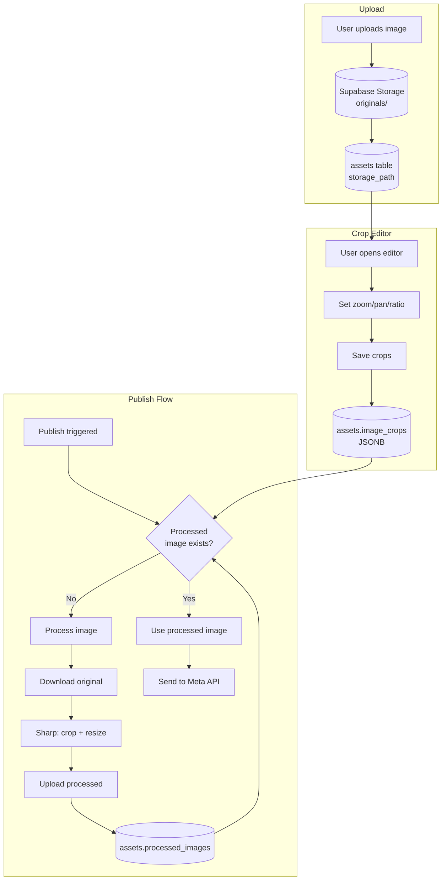

# Image Processing for Meta Publishing

> **Created:** 2025-01-XX — Server-side image processing to meet Meta's exact requirements.

## TL;DR (for AI tools)

- Images are processed server-side before publishing to Meta (Instagram/Facebook).
- Processing applies user-defined crops and resizes to Meta's exact dimensions.
- Meta dimensions: 1:1 (1080x1080), 4:5 (1080x1350), 1.91:1 (1080x566), 9:16 (1080x1920).
- Uses Sharp library for high-quality image processing.
- Processed images are stored alongside originals in Supabase Storage.
- The `processed_images` JSONB column on `assets` tracks processed versions.

---

## 1. Overview

When publishing to Instagram or Facebook, images must meet specific requirements:

1. **Aspect Ratios:** Meta supports specific ratios (1:1, 4:5, 1.91:1, 9:16).
2. **Dimensions:** Optimal quality at 1080px base width.
3. **Format:** JPEG or PNG (not GIF/WebP).
4. **File Size:** Max 30MB for images, 200MB for videos.

Ferdy's image processing ensures:
- User crop selections are **actually applied** (not just previewed).
- Images are resized to Meta's exact dimensions.
- Format conversion where needed.

---

## 2. Components

### 2.1 Image Processing Library

**File:** `src/lib/image-processing/processImage.ts`

Core function that uses Sharp to:
1. Extract the crop region based on user's scale/pan settings.
2. Resize to Meta's target dimensions.
3. Output optimized JPEG (quality 90).

```typescript
processImage(
  imageBuffer: Buffer,
  aspectRatio: '1:1' | '4:5' | '1.91:1' | '9:16',
  crop: { scale: number, x: number, y: number }
): Promise<{ buffer: Buffer, width: number, height: number }>
```

**Target Dimensions:**
| Aspect Ratio | Width | Height |
|--------------|-------|--------|
| 1:1          | 1080  | 1080   |
| 4:5          | 1080  | 1350   |
| 1.91:1       | 1080  | 566    |
| 9:16         | 1080  | 1920   |

### 2.2 Processing API Endpoint

**File:** `src/app/api/assets/process/route.ts`

```
POST /api/assets/process
Body: { assetId: string, aspectRatio: '1:1' | '4:5' | '1.91:1' | '9:16' }
Returns: { success: true, publicUrl: string, processedPath: string }
```

Flow:
1. Fetch asset from database.
2. Download original from Supabase Storage.
3. Apply crop using stored `image_crops` coordinates.
4. Resize to Meta dimensions.
5. Upload processed image to `{path}/processed/{name}_{ratio}.jpg`.
6. Update `processed_images` JSONB column.
7. Return public URL.

### 2.3 Database Schema

**Column:** `assets.processed_images` (JSONB)

```json
{
  "1:1": {
    "storage_path": "brands/abc/originals/processed/image_1_1.jpg",
    "width": 1080,
    "height": 1080,
    "processed_at": "2025-01-15T10:30:00Z"
  },
  "4:5": {
    "storage_path": "brands/abc/originals/processed/image_4_5.jpg",
    "width": 1080,
    "height": 1350,
    "processed_at": "2025-01-15T10:30:00Z"
  }
}
```

**Migration:** `supabase/sql/schema/add_processed_images_to_assets.sql`

### 2.4 Meta Validation

**File:** `src/lib/publishing/validateAssetForMeta.ts`

Validates assets before publishing:
- **Format:** Blocks GIF/WebP (not supported by Meta).
- **Dimensions:** Minimum 320x320, recommended 600x600.
- **File Size:** Max 30MB images, 200MB videos.

Returns errors (blocking) and warnings (non-blocking).

---

## 3. Processing Flow

### 3.1 User Uploads Image

1. User uploads image via Content Library.
2. Image stored as original in Supabase Storage.
3. `assets` record created with `storage_path`.

### 3.2 User Sets Crop

1. User opens image in crop editor.
2. Selects aspect ratio (1:1, 4:5, etc.).
3. Adjusts zoom and pan.
4. On save, `image_crops` JSONB updated with coordinates.

### 3.3 Pre-Publish Processing

When publishing (via publishJob.ts):

1. `ensureAssetsProcessed()` is called.
2. For each image asset:
   - Validate against Meta requirements.
   - Check if processed version exists for aspect ratio.
   - If missing, process the image:
     - Download original.
     - Apply crop from `image_crops`.
     - Resize to Meta dimensions.
     - Upload processed version.
     - Update `processed_images`.
3. Publishing providers use processed images.

### 3.4 Publishing

1. Instagram/Facebook providers call `getAssetPublicUrl()`.
2. Function checks `processed_images[aspectRatio]`.
3. Uses processed image path if available.
4. Falls back to original if not processed.

---

## 4. Crop Coordinate System

Crops are stored as normalized coordinates:

```typescript
{
  scale: number,  // Zoom level (1 = fit, higher = zoomed in)
  x: number,      // Pan X offset (-1 to 1)
  y: number       // Pan Y offset (-1 to 1)
}
```

**Scale:** The minimum scale is calculated so the image fills the frame. User can zoom up to 4x.

**Pan (x, y):**
- 0 = centered
- -1 = shifted left/up to max
- 1 = shifted right/down to max

The processing algorithm converts these to pixel coordinates for extraction.

---

## 5. Content Library UI

### 5.1 Crop Editor

- User drags to pan.
- Ctrl+scroll (pinch) to zoom.
- +/- buttons for zoom control.
- Slider for precise zoom.
- Format buttons for aspect ratio selection.

### 5.2 Upload Warnings

**File:** `src/hooks/assets/useUploadAsset.ts`

On upload, warns if:
- Image is GIF/WebP (not supported by Meta).
- Dimensions below 600x600 (quality warning).

These are warnings, not blocking errors. Upload proceeds.

---

## 6. File Size Limits

**Enforced at upload time:**
- Images: 30MB max (Meta's limit)
- Videos: 200MB max

**Files:**
- `src/components/assets/UploadAsset.tsx`
- `src/components/assets/AssetUploadMenu.tsx`

---

## 7. Storage Structure

```
ferdy-assets/
├── brands/{brandId}/
│   ├── originals/
│   │   ├── {assetId}.jpg           # Original upload
│   │   └── processed/
│   │       ├── {assetId}_1_1.jpg   # 1:1 processed
│   │       ├── {assetId}_4_5.jpg   # 4:5 processed
│   │       └── ...
│   └── thumbnails/
│       └── {assetId}.jpg           # Video thumbnails
└── videos/{brandId}/
    └── {assetId}.mp4               # Video files
```

---

## 8. Error Handling

### 8.1 Validation Errors (Blocking)

These prevent publishing:
- GIF/WebP format.
- Dimensions below 320x320.
- File size exceeds limits.

### 8.2 Processing Errors (Non-Blocking)

If processing fails:
- Error is logged.
- Publishing continues with original image.
- May fail at Meta's end with dimension errors.

### 8.3 Warnings (Non-Blocking)

Shown to user but don't block:
- Dimensions below 600x600.
- Unusual aspect ratios.

---

## 9. Mermaid Diagram



---

## 10. Related Documentation

- `post_jobs_and_publishing_engine.md` - Publishing flow.
- `asset_selection.md` - Asset tagging and selection.
- `social_api_connections.md` - Meta API integration.

---

## 11. Implementation Notes

### Dependencies

```bash
npm install sharp @types/sharp
```

### Sharp Configuration

Sharp is used server-side only. It provides:
- Fast image processing.
- High-quality Lanczos3 resampling.
- JPEG optimization with progressive encoding.

### Performance

- Processing happens once per aspect ratio per asset.
- Processed images are cached (stored permanently).
- No re-processing unless crops change.

### Public Asset URLs

The `ferdy-assets` Supabase Storage bucket is **public**. All asset URLs are constructed synchronously with zero API calls using `getPublicUrl()` from `src/lib/storage/publicUrl.ts`.

**Key files:**
- `src/lib/storage/publicUrl.ts` — `getPublicUrl(storagePath, transform?)` builds a public URL synchronously. `resolveAssetUrls(asset, transform?)` populates `signed_url` and `thumbnail_signed_url` on an asset object. Exports `GRID_THUMBNAIL` constant for grid views.
- `src/hooks/assets/useAssets.ts` — Calls `resolveAssetUrls()` in `mapAsset()` so every asset has URLs immediately on first render. No async resolution, no Phase 2.

**Performance:** URLs are available instantly — zero API calls, zero async state, zero re-renders for URL resolution.

### Future Improvements

- Automatic re-processing when crops change.
- Background processing queue for large batches.
- WebP/AVIF output for modern browsers (keep JPEG for Meta).
