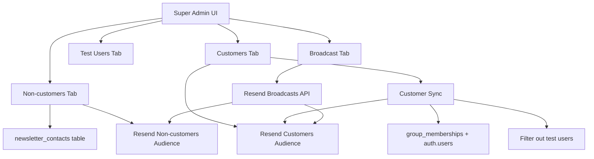

# Newsletter Contact Management

> **Last updated:** 2 April 2026

This document describes Ferdy's newsletter system — a standalone broadcast email system built on Resend, completely separate from transactional emails (`src/lib/emails/send.ts`). It manages two audiences (Customers and Non-customers), excludes test users, and provides a Super Admin UI for contact management and broadcasting.

---

## Overview

---

## Audiences

Two Resend audiences are used, configured via environment variables:

| Audience | Env Var | Description |
|----------|---------|-------------|
| Customers | `RESEND_AUDIENCE_CUSTOMERS` | Active paying users, auto-synced from DB |
| Non-customers | `RESEND_AUDIENCE_NON_CUSTOMERS` | Manually added prospects, referrers, friends |

### Initial Setup

Audiences are created once via the Setup Banner in the Super Admin UI, or by calling `POST /api/newsletter/setup`. The returned audience IDs must be added as environment variables in Vercel.

---

## Test User Exclusion

Test users are excluded from **both** audiences. A user is considered a test user if:

1. `profiles.is_test_user = true` (flag in DB), OR
2. Their email matches the pattern `andrew+*@adhoc.help`

### Managing Test Users

- The **Test Users** tab in the Super Admin UI shows all flagged/matching users
- Toggle `is_test_user` via `PATCH /api/newsletter/test-users`
- The `is_test_user` column was added via migration `20260402_add_is_test_user_to_profiles.sql`

---

## Customer Sync

Active customers are synced to the Resend Customers audience. Sync is **additive only** — churned customers remain in the audience.

### How it works

1. Query `group_memberships` joined to `groups` where `subscription_status = 'active'`
2. Join to `auth.users` for email, `profiles` for name
3. Filter out test users
4. Upsert each contact into the Resend Customers audience
5. If a synced customer also exists in `newsletter_contacts` (Non-customers), remove them from that audience and delete the local record

### Trigger methods

| Method | How |
|--------|-----|
| **Daily cron** | Vercel Cron at `0 6 * * *` UTC → `GET /api/newsletter/sync` (authenticated via `CRON_SECRET` header) |
| **Manual** | "Sync Now" button in Customers tab → `POST /api/newsletter/sync` (Super Admin Bearer token) |

### Sync route dual auth

The sync endpoint accepts either:
- `Authorization: Bearer <cron_secret>` header (Vercel Cron)
- `Authorization: Bearer <user_access_token>` header (Super Admin)

---

## Non-customer Contacts

Non-customers are manually managed via the Super Admin UI. Each contact has:

- `first_name`, `last_name`, `email` (unique)
- `contact_type`: Prospect, Referrer, or Friend
- `resend_contact_id`: ID in Resend's Non-customers audience

### Database

Table: `newsletter_contacts` (created via `20260402_create_newsletter_contacts.sql`)

- RLS enabled, service_role only access
- Email uniqueness enforced at DB level

### Adding a contact

1. Validate email is not a test user pattern
2. Insert into `newsletter_contacts` table
3. Add to Resend Non-customers audience via API
4. Store returned `resend_contact_id`

### Removing a contact

1. Remove from Resend audience using `resend_contact_id`
2. Delete from `newsletter_contacts` table

---

## Broadcasting

The Broadcast tab provides a structured email composer with live preview.

### Content fields

| Field | Required | Description |
|-------|----------|-------------|
| Subject Line | Yes | Email subject (prefixed with `[TEST]` for test emails) |
| Heading | No | Large heading at top of email body |
| Body | No | Main content, paragraphs separated by blank lines |
| Image URL | No | Hero image below heading |
| YouTube Video | No | Clickable thumbnail with play button overlay |
| YouTube Position | No | Above or below body text (default: below) |
| Button Text + Link | No | CTA button |

### Merge fields

Resend-native merge tags can be inserted into the body text:

| Tag | Description |
|-----|-------------|
| `{{first_name}}` | Recipient's first name |
| `{{last_name}}` | Recipient's last name |
| `{{email}}` | Recipient's email address |

Quick-insert buttons are provided below the body textarea.

### Unsubscribe

All emails include an unsubscribe link in the footer using the Resend merge tag `{{{RESEND_UNSUBSCRIBE_URL}}}` (triple braces). This is automatically replaced by Resend with a per-recipient unsubscribe URL.

### Sending flow

1. **Compose** — Fill in content fields, preview in live iframe
2. **Test** — Send a test email to yourself (uses `POST /api/newsletter/broadcast` with `testEmail` field)
3. **Select audiences** — Choose Customers, Non-customers, or both
4. **Send** — Broadcasts are created and sent via Resend Broadcasts API (two-step: `create()` then `send()`)

### Email template

The email uses inline CSS (no classes) for email client compatibility:
- Ferdy branding: `#6366F1` indigo primary, Inter font
- Header: "Ferdy" wordmark with indigo bottom border
- Footer: copyright, contact email, unsubscribe link
- Sender: `Ferdy <support@ferdy.io>`

---

## API Routes

All routes require Super Admin authentication (Bearer token → `supabaseAdmin.auth.getUser()` → `isSuperAdmin()`).

| Route | Methods | Description |
|-------|---------|-------------|
| `/api/newsletter/setup` | POST | One-time audience creation in Resend |
| `/api/newsletter/contacts` | GET, POST, DELETE | Manage non-customer contacts |
| `/api/newsletter/customers` | GET | List contacts from Resend Customers audience |
| `/api/newsletter/sync` | GET, POST | Trigger customer sync (dual auth: cron or super admin) |
| `/api/newsletter/test-users` | GET, PATCH | List and toggle test users |
| `/api/newsletter/broadcast` | GET, POST | List broadcasts / send test email / send broadcast |

---

## Key Files

| File | Purpose |
|------|---------|
| `src/app/(dashboard)/super-admin/newsletter-contacts/page.tsx` | Super Admin UI (all 4 tabs + setup banner) |
| `src/lib/newsletter/types.ts` | Type definitions |
| `src/lib/newsletter/resend.ts` | Resend API wrapper (isolated from transactional emails) |
| `src/lib/newsletter/test-users.ts` | Test user detection and queries |
| `src/lib/newsletter/sync-customers.ts` | Customer sync logic |
| `src/lib/newsletter/broadcast.ts` | Broadcast creation and sending |
| `src/app/api/newsletter/setup/route.ts` | Audience setup endpoint |
| `src/app/api/newsletter/contacts/route.ts` | Non-customer CRUD |
| `src/app/api/newsletter/customers/route.ts` | Customer list from Resend |
| `src/app/api/newsletter/sync/route.ts` | Sync trigger endpoint |
| `src/app/api/newsletter/test-users/route.ts` | Test user management |
| `src/app/api/newsletter/broadcast/route.ts` | Broadcast + test email endpoint |
| `supabase/migrations/20260402_add_is_test_user_to_profiles.sql` | is_test_user column migration |
| `supabase/migrations/20260402_create_newsletter_contacts.sql` | newsletter_contacts table migration |

---

## Environment Variables

| Variable | Description |
|----------|-------------|
| `RESEND_API_KEY` | Shared Resend API key (same as transactional) |
| `RESEND_AUDIENCE_CUSTOMERS` | Resend audience ID for customers |
| `RESEND_AUDIENCE_NON_CUSTOMERS` | Resend audience ID for non-customers |

---

## Important Notes

- The newsletter system uses its own Resend instance (`getNewsletterResend()`) — **never import from `src/lib/emails/send.ts`**
- Customer sync is additive only; churned customers stay in the audience to allow re-engagement
- When a non-customer becomes a paying customer, the sync automatically removes them from the Non-customers audience
- YouTube videos cannot be embedded in email — a clickable thumbnail with a play button overlay links to YouTube
- All email HTML uses inline styles only (no CSS classes) for maximum email client compatibility
- The `{{{RESEND_UNSUBSCRIBE_URL}}}` merge tag uses triple braces (Resend requirement)
- Merge fields (`{{first_name}}`, etc.) are replaced per-recipient by Resend during broadcast delivery
