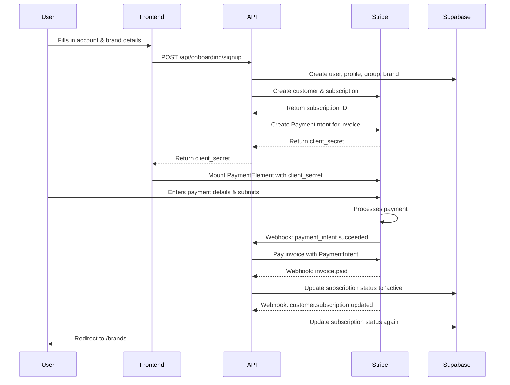

# Onboarding Process

## Overview

The onboarding process is a 2-step wizard that:
1. Creates a new user account, group, and brand
2. Sets up a Stripe subscription for per-brand billing

This document details the complete technical flow from user input to active subscription.

## Architecture



## Step 1: Account & Brand Creation

**Route:** `/onboarding/start`  
**Component:** `OnboardingWizard.tsx`

### User Input
- Company/Agency Name
- First Brand Name
- Full Name
- Email
- Password

### API Call
When the user submits the form, the frontend calls:

`POST /api/onboarding/signup`

**Request Body:**
```json
{
  "groupName": "Chris Agency",
  "brandName": "Bryant Co",
  "fullName": "Chris Bryant",
  "email": "chris@bryant.co",
  "password": "..."
}
```

### Backend Logic (`/api/onboarding/signup/route.ts`)

1. **Create User:** Creates a new user in `auth.users` with Supabase Admin client.
2. **Create Profile:** Creates a user profile in `user_profiles` table.
3. **Create Group:** Creates a new `groups` record.
4. **Create Group Membership:** Links the user to the group as `owner` in `group_memberships`.
5. **Create Brand:** Creates the first `brands` record, linked to the group.
6. **Create Brand Membership:** Links the user to the brand as `owner` in `brand_memberships`.

After creating the database records, the API calls the Stripe helper function:

`createStripeSubscription(groupId, groupName, email, 1)`

## Step 2: Stripe Subscription & Payment

### Stripe Subscription Logic (`/lib/stripe-helpers.ts`)

1. **Create Stripe Customer:** Creates a new Stripe customer with the user's email and group name.
2. **Create Stripe Subscription:** Creates a subscription with `payment_behavior: 'default_incomplete'`.
   - This creates the subscription and an initial invoice, but does not charge the user yet.
3. **Create PaymentIntent:** Manually creates a separate `PaymentIntent` for the invoice amount.
   - This is the key step that generates a `client_secret` for the payment form.
4. **Return Client Secret:** The `client_secret` from the PaymentIntent is returned to the frontend.

### Frontend Payment Form

- The `OnboardingWizard` receives the `client_secret`.
- It mounts the Stripe `PaymentElement` using the `client_secret`.
- The user enters their card details and submits the form directly to Stripe.

## Step 3: Webhook Payment Handling

When the user pays, Stripe sends a series of webhooks to `/api/stripe/webhook` to automate the post-payment process.

### Webhook Flow

1. **`payment_intent.succeeded`**
   - This is the first webhook to fire after a successful payment.
   - The handler (`handlePaymentIntentSucceeded`) uses the `invoice_id` from the PaymentIntent metadata to pay the subscription's invoice.
   - It calls `stripe.invoices.pay(invoiceId, { paid_out_of_band: true })` to mark the invoice as paid.

2. **`invoice.paid`**
   - Marking the invoice as paid triggers this webhook.
   - The handler (`handleInvoicePaid`) sends a receipt email to the user.

3. **`customer.subscription.updated`**
   - Paying the invoice automatically activates the subscription.
   - This webhook fires with `status: 'active'`.
   - The handler (`handleSubscriptionUpdate`) updates the `subscription_status` column in the `groups` table to **`active`**.

### Final State
- The user is redirected to `/brands`.
- The subscription is active in Stripe.
- The `groups` table shows `subscription_status: 'active'`.
- The user can now use the app with a fully active subscription.

## Database Schema Additions

To support this flow, the following column was added:

### `groups` Table
- `subscription_status` (TEXT, default: 'incomplete')
  - Caches the Stripe subscription status.
  - Values: `incomplete`, `active`, `past_due`, `canceled`

## Troubleshooting & Key Learnings

- **`payment_behavior: 'default_incomplete'` is tricky:** It creates a subscription and invoice, but does NOT create a PaymentIntent. A PaymentIntent must be created manually to get a `client_secret` for the payment form.

- **Webhooks are critical:** The entire post-payment flow is asynchronous and relies on a chain of webhooks. Ensure the webhook endpoint is configured to receive:
  - `payment_intent.succeeded`
  - `invoice.paid`
  - `customer.subscription.created`
  - `customer.subscription.updated`
  - `customer.subscription.deleted`

- **Orphaned Records:** Failed onboarding attempts can create orphaned records in Supabase (users, groups, brands). A cleanup process should be implemented to remove these.
