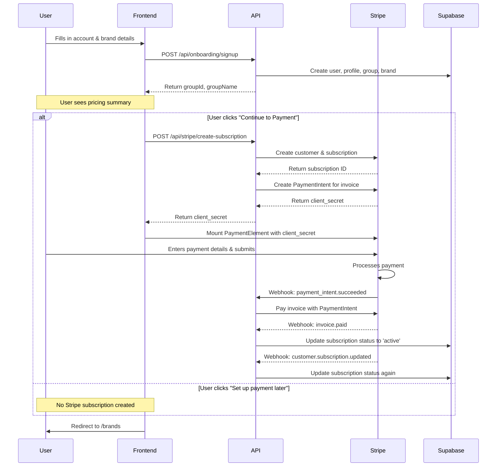

# User Onboarding & Initial Setup

This document outlines the complete user onboarding process, from initial sign-up to an active, billable account. The process is designed as a two-step wizard that guides the user through creating their account, their first brand, and setting up their subscription.

## Onboarding Flow Architecture

The onboarding process involves a coordinated sequence of events between the user, the frontend application, the backend API, Stripe for payments, and Supabase for data persistence. The following diagram illustrates the high-level flow:

## Step 1: Account and Brand Creation

The first step of the onboarding process is to collect the user's information and create the necessary records in the database. This is handled by the `/onboarding/start` route and the `OnboardingWizard.tsx` component.

### User Input

The user is prompted to provide the following information:
- **Multiple Brands Question**: Whether the user will manage multiple brands (agency/group) or just one brand.
- **Company/Agency Name**: The name of the group that will own the brands (if managing multiple brands).
- **First Brand Name**: The name of the user's first brand.
- **Full Name**: The user's full name.
- **Email**: The user's email address, which will be used for login and communication.
- **Password**: The user's password for account security.
- **Country Code**: The country where the brand operates.
- **Password**: A password for the new account.

### API Request and Backend Logic

Upon form submission, the frontend sends a `POST` request to the `/api/onboarding/signup` endpoint. The backend then performs the following actions:

1.  **Create User**: A new user is created in the `auth.users` table using the Supabase Admin client.
2.  **Create Profile**: A corresponding user profile is created in the `user_profiles` view, which includes the user's full name.
3.  **Create Group**: A new group is created in the `groups` table to represent the user's organization or agency.
4.  **Create Group Membership**: The user is linked to the newly created group as an `owner` in the `group_memberships` table.
5.  **Create Brand**: The user's first brand is created in the `brands` table and associated with the group.
6.  **Create Brand Membership**: The user is also linked to the new brand as an `owner` in the `brand_memberships` table.

After these database operations are complete, the frontend signs in the user and advances to Step 2. **No Stripe subscription is created at this point.**

## Step 2: Pricing Review & Payment Decision

After account creation, the user sees a pricing summary screen with two options:

- **"Continue to Payment"** — Creates the Stripe subscription and shows the payment form.
- **"Set up payment later"** — Redirects to `/brands` without creating any Stripe objects.

This ensures that skipping payment does **not** leave orphaned incomplete subscriptions in Stripe.

### Subscription Creation (on "Continue to Payment")

When the user clicks "Continue to Payment", the frontend calls `/api/stripe/create-subscription` which invokes the `createStripeSubscription` helper:

1.  **Create Stripe Customer**: A new customer is created in Stripe using the user's email, group name, and country code (for tax purposes).
2.  **Create Stripe Subscription**: A new subscription is created with `payment_behavior: 'default_incomplete'`. For NZ customers, the 15% GST tax rate is applied via `default_tax_rates`.
3.  **Create PaymentIntent**: A `PaymentIntent` is created for the invoice amount, generating a `client_secret`.
4.  **Return Client Secret**: The `client_secret` is returned to the frontend for the payment form.

### Frontend Payment Form

Once the subscription is created, the `OnboardingWizard` mounts the Stripe `PaymentElement` with the `client_secret`. The user enters payment details and submits directly to Stripe.

### Skipping Payment Setup

Users can skip payment by clicking "Set up payment later" on the pricing summary screen. This allows for:

- **Manual onboarding**: Admins can create accounts for clients and set up payment later.
- **Testing**: Development and testing workflows without requiring payment.
- **Flexible onboarding**: Users can explore the platform before committing to payment.

When payment is skipped:
1. The user is redirected to `/brands` with **no Stripe subscription** (no customer, no incomplete subscription).
2. The `subscription_status` in the `groups` table remains `NULL` (no subscription exists).
3. A prominent warning banner appears on the billing page (`/account/billing`) for users with billing permissions.
4. The banner includes a "Complete Payment Setup" button that redirects to `/onboarding/payment-setup`.
5. The payment setup page creates a new Stripe subscription and presents the payment form.
6. Once payment is completed, the subscription becomes active and the warning banner is hidden.

## Step 3: Webhook-Driven Payment Handling

Once the user submits their payment, Stripe sends a series of webhooks to the `/api/stripe/webhook` endpoint to automate the post-payment workflow.

### Webhook Sequence

The following webhooks are processed in sequence:

1.  **`payment_intent.succeeded`**: This is the first webhook to be sent after a successful payment. The `handlePaymentIntentSucceeded` handler uses the `invoice_id` from the PaymentIntent metadata to pay the subscription's invoice.
2.  **`invoice.paid`**: This webhook is triggered after the invoice is marked as paid. The `handleInvoicePaid` handler sends a receipt email to the user.
3.  **`customer.subscription.updated`**: This webhook is sent when the subscription becomes active. The `handleSubscriptionUpdate` handler updates the `subscription_status` in the `groups` table to `active`.

## Final State and Key Considerations

Upon successful completion of the onboarding process, the user is redirected to the `/brands` page, their subscription is active in Stripe, and the `groups` table reflects the `active` subscription status. The user can now fully utilize the application.

### Database Schema

The onboarding flow required the addition of a `subscription_status` column to the `groups` table to cache the Stripe subscription status. The possible values are:

- **`incomplete`**: Payment has not been set up or completed (default for new accounts).
- **`active`**: Subscription is active and in good standing.
- **`past_due`**: Payment failed and needs to be updated.
- **`canceled`**: Subscription has been canceled.

This field is used to determine whether to show the payment setup warning in the billing page.

### Important Notes

-   The use of `payment_behavior: 'default_incomplete'` is a key aspect of this flow, as it allows for the creation of a subscription and invoice without immediate payment. A `PaymentIntent` must be created manually to obtain a `client_secret`.
-   The entire post-payment process is asynchronous and relies on a chain of webhooks. It is crucial to ensure that the webhook endpoint is correctly configured to receive all necessary events.
-   Failed onboarding attempts can result in orphaned records in the database. A cleanup process should be implemented to identify and remove these records.
